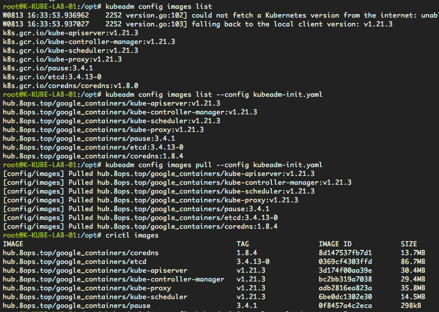
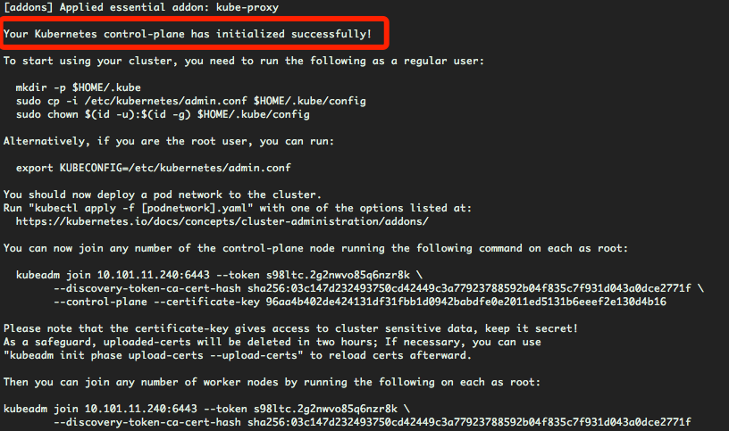

# Kubernetes Cluster 快速搭建

*跟着我的笔记一步一步操作成功搭建 kubernetes cluster吧*

> 目录

- 一、背景描述

- - 1.1 机器准备
  - 1.2 软件版本
  - 1.3 部署架构
  - 1.4 环境说明

- 二、前期准备

- - 2.1 一键优化

- 三、实施部署

- - 3.1 容器运行时
  - 3.2 初始kubeadm环境
  - 3.3 初始cluster环境
  - 3.4 join节点
  - 3.5 验收集群


------


## 一、背景描述

采用**kubeadm**方式安装[[1\]](https://kubernetes.io/zh/docs/setup/production-environment/tools/kubeadm/create-cluster-kubeadm/)


### 1.1 机器准备

| 主机名称      | 主机IP        | 操作系统           | 角色分配             |
| ------------- | ------------- | ------------------ | -------------------- |
| K-KUBE-LAB-01 | 10.101.11.240 | Ubuntu 20.04.2 LTS | control-plane,master |
| K-KUBE-LAB-02 | 10.101.11.146 | Ubuntu 20.04.2 LTS | control-plane,master |
| K-KUBE-LAB-03 | 10.101.11.154 | Ubuntu 20.04.2 LTS | control-plane,master |
| K-KUBE-LAB-04 | 10.101.11.234 | Ubuntu 20.04.2 LTS | node                 |
| K-KUBE-LAB-05 | 10.101.11.171 | Ubuntu 20.04.2 LTS | node                 |

机器参考官方最小配置指导，采用**2**核CPU/**8**G内存/**100**G磁盘，私有化虚拟机部署。


### 1.2 软件版本

截止目前的最新匹配版本

| 软件名称                                                     | 版本     |
| ------------------------------------------------------------ | -------- |
| kubeadm                                                      | v1.21.3  |
| kubelet                                                      | v1.21.3  |
| kubernetes                                                   | v1.21.3  |
| etcd                                                         | 3.4.13-0 |
| flannel                                                      | v0.14.0  |
| coredns                                                      | 1.8.4    |
| containerd.io | 1.4.9-1  |

- kubeadm[[2\]](https://github.com/kubernetes/kubeadm)
- kubernetes[[3\]](https://github.com/kubernetes/kubernetes)
- cni[[4\]](https://github.com/containernetworking/cni)
- containerd[[5\]](https://github.com/containerd/containerd)
- flannel[[6\]](https://github.com/flannel-io/flannel)
- coredns[[7\]](https://github.com/coredns/coredns)
- dashboard[[8\]](https://github.com/kubernetes/dashboard)


### 1.3 部署架构


### 1.4 环境说明

- 国内私有云网络环境
- 镜像提前下载到私有环境harbor（可以从阿里云镜像中转下载）


------

## 二、前期准备

进行必要的操作让每个节点符合kubernetes安装的要求

### 2.1 一键优化

优化内容包括

- 优化文件打开数
- 关闭swap
- 启动必要模块
- 优化内核
- 优化软件源
- 安装必要软件
- kubectl命令bash补全

```text
curl -s https://m.8ops.top/attachment/kubernetes/01-init.sh | bash
```


------


## 三、实施部署

### 3.1 容器运行时

在所有节点需要执行的操作

> 使用containerd做为容器运行时

```bash
apt install -y containerd.io=1.4.9-1 

apt-mark hold containerd.io
apt-mark showhold
```

更多容器运行时[[9\]](https://kubernetes.io/zh/docs/setup/production-environment/container-runtimes/)

> 默认配置

```bash
containerd config default
```


```bash
curl -s https://m.8ops.top/attachment/kubernetes/containerd-config-usage.toml \
  -o /etc/containerd/config.toml
```


### 3.2 初始kubeadm环境

在所有节点需要执行的操作

> 安装kubeadm必要软件包

```bash
apt install -y kubelet=1.21.3-00 kubeadm=1.21.3-00 kubectl=1.21.3-00

apt-mark hold kubelet kubeadm kubectl
apt-mark showhold
```

> 完善crictl执行配置

```bash
cat > /etc/systemd/system/kubelet.service.d/0-containerd.conf <<EOF
[Service]
Environment="KUBELET_EXTRA_ARGS=--container-runtime=remote --runtime-request-timeout=15m --container-runtime-endpoint=unix:///run/containerd/containerd.sock"
EOF

cat > /etc/crictl.yaml <<EOF
runtime-endpoint: unix:///run/containerd/containerd.sock
image-endpoint: unix:///run/containerd/containerd.sock
timeout: 10
debug: false
EOF

systemctl restart containerd
crictl images
```

不配置指定时会默认依次按顺序使用：docker->containerd->cri-o

```bash
WARN[0000] image connect using default endpoints: [unix:///var/run/dockershim.sock unix:///run/containerd/containerd.sock unix:///run/crio/crio.sock]
```

若docker没有则报错，如下

```bash
FATA[0010] failed to connect: failed to connect: context deadline exceeded
```

###  

### 3.3 初始化集群

选择其中一台 control-plane,master 节点，这里选择 10.101.11.240

> 默认配置

```bash
kubeadm config print init-defaults
```


```bash
curl -s https://m.8ops.top/attachment/kubernetes/kubeadmin-init-usage.yaml \
  -o kubeadm-init.yaml

#OR
#curl -s https://m.8ops.top/attachment/kubernetes/kubeadmin-init-usage-v2.yaml \
#  -o kubeadm-init.yaml
```

> 操作镜像

```bash
# 默认镜像
kubeadm config images list -v 5
# 打印镜像
kubeadm config images list --config kubeadm-init.yaml -v 5
# 预取镜像
kubeadm config images pull --config kubeadm-init.yaml -v 5
```



> 初始化集群

```bash
kubeadm init --config kubeadm-init.yaml --upload-certs -v 5
```



> 配置缺省时kubeconfig文件

```bash
mkdir -p ~/.kube && ln -s /etc/kubernetes/admin.conf ~/.kube/config 
```

> 查看节点

```bash
kubectl get no
```


### 3.4 Join 节点

获取Join信息

**方式一**

在初始化集群成功时输出的信息中有打印出来，参考上面Output内容


**方式二**

> **上传certs**

```bash
# 上传 cert
kubeadm init phase upload-certs --upload-certs
# 生成 token
kubeadm token generate
# 打印 join control-plane,master
kubeadm token create n1em3c.bc2bvyp7rrka399e --print-join-command -v 5 \
  --certificate-key 8b0c2a63ff252e88f0a87a82e9b4ff6059984b2ed3c7bc60523ceb001ebcfb64
# 打印 join node
kubeadm token create 3gn6g3.53pxqq890sjxuzjh --print-join-command -v 5
```

> 查看 token list

```bash
kubeadm token list
```


> join control-plane,master

```bash
kubeadm join 10.101.10.11:6443 --token abcdef.0123456789abcdef \
 --discovery-token-ca-cert-hash sha256:ae1d593bbadecf245c30f4c1cfe9250faa0aaa9e4c27b7f34bcb10142d0dd0c8 \
 --control-plane --certificate-key 811e33703005a1df116201ae6469d86746274c3579e62b7c924cc4c13a804bca -v 5in the cluster.
```

> join node

```bash
kubeadm join 10.101.10.11:6443 --token abcdef.0123456789abcdef \
  --discovery-token-ca-cert-hash sha256:ae1d593bbadecf245c30f4c1cfe9250faa0aaa9e4c27b7f34bcb10142d0dd0c8
```


### 3.5 验收集群

> 查看cluster-info

```bash
kubectl cluster-info
```


OR

```bash
kubectl get cs
```


controller-manager和scheduler未健康就位，修复此问题

```bash
sed -i '/--port/d' /etc/kubernetes/manifests/kube-controller-manager.yaml
sed -i '/--port/d' /etc/kubernetes/manifests/kube-scheduler.yaml
```

即时自动生效


> 部署flannel

```bash
kubectl apply -f https://m.8ops.top/attachment/kubernetes/kube-flannel.yaml
```

> 查看应用

```bash
kubectl get all -A
```


coredns未就位，修复此问题

```bash
kubectl edit clusterrole system:coredns
```

append

```bash
- apiGroups:
  - discovery.k8s.io
  resources:
  - endpointslices
  verbs:
  - list
  - watch
```

删除原有pod/coredns-xx

```bash
kubectl -n kube-system delete pod/coredns-55866688ff-hwp4m pod/coredns-55866688ff-tn8sj
```

> 查看节点

```bash
kubectl get no
```


至此 kubernetes cluster 搭建完成了。


------


