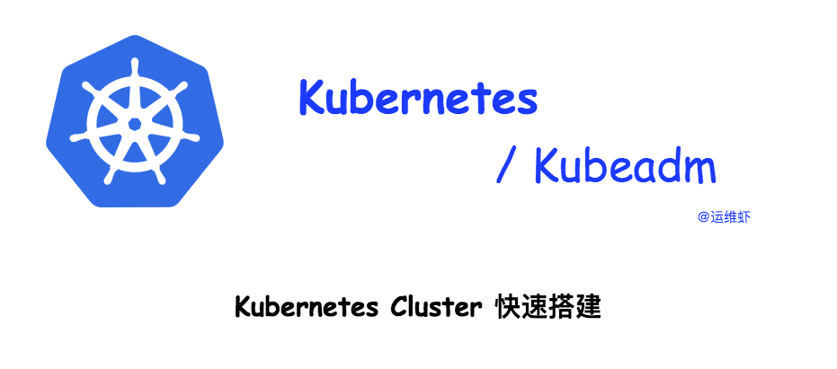
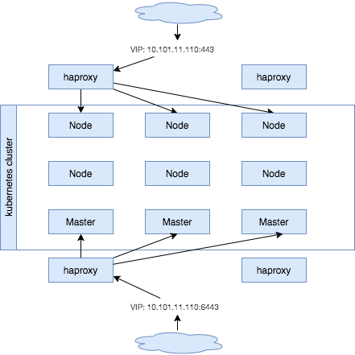
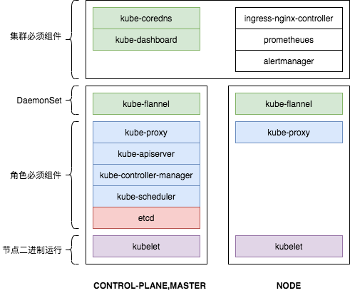
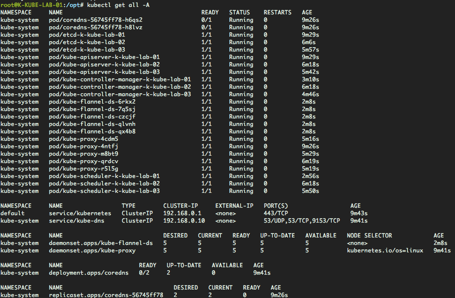
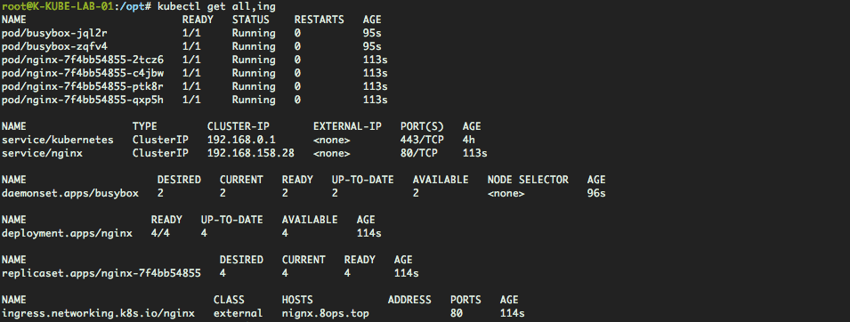

# Kubernetes Cluster 快速搭建



Kubernetes 是一个开源的容器编排引擎，用来对容器化应用进行自动化部署、 扩缩和管理。

从CNCF毕业，Kubernetes是当下最火热的技术各大中小互联网公司都在积极推进他的落地。

*接下来跟着我的笔记一步一步操作简单快速搭建 kubernetes cluster吧*。


> 目录

一、背景描述

- 1.1 机器准备
- 1.2 软件版本
- 1.3 部署架构
- 1.4 环境说明

二、前期准备

- 2.1 一键优化

三、实施部署

- 3.1 容器运行时
- 3.2 初始kubeadm环境
- 3.3 初始cluster环境
- 3.4 join节点
- 3.5 验收集群


------


## 一、背景描述

采用**kubeadm**方式安装[[1]](https://kubernetes.io/zh/docs/setup/production-environment/tools/kubeadm/create-cluster-kubeadm/)


### 1.1 机器准备

| 主机名称      | 主机IP        | 操作系统           | 角色分配             |
| ------------- | ------------- | ------------------ | -------------------- |
| K-KUBE-LAB-01 | 10.101.11.240 | Ubuntu 20.04.2 LTS | control-plane,master |
| K-KUBE-LAB-02 | 10.101.11.146 | Ubuntu 20.04.2 LTS | control-plane,master |
| K-KUBE-LAB-03 | 10.101.11.154 | Ubuntu 20.04.2 LTS | control-plane,master |
| K-KUBE-LAB-04 | 10.101.11.234 | Ubuntu 20.04.2 LTS | node                 |
| K-KUBE-LAB-05 | 10.101.11.171 | Ubuntu 20.04.2 LTS | node                 |

机器参考官方最小配置指导，采用**2**核CPU/**8**G内存/**100**G磁盘，私有化虚拟机部署。


### 1.2 软件版本

示例匹配版本

| 软件名称   | 选中版本               | 当前最新 |
| ---------- | ---------------------- | -------- |
| kubeadm    | v1.22.2                | v1.23.0  |
| kubelet    | v1.22.2                | v1.23.0  |
| kubernetes | v1.22.2                | v1.23.0  |
| etcd       | 3.4.13-0               | v3.5.1   |
| flannel    | v0.15.0                | v0.15.1  |
| coredns    | 1.8.4                  | 1.8.6    |
| containerd | 1.5.5-0ubuntu3~20.04.1 | 1.5.8    |

- kubeadm  [[2]](https://github.com/kubernetes/kubeadm)
- kubernetes  [[3]](https://github.com/kubernetes/kubernetes)
- [etcd](https://etcd.io/)  [[4]](https://github.com/etcd-io/etcd) 
- cni  [[5]](https://github.com/containernetworking/cni)
- containerd  [[6]](https://github.com/containerd/containerd)
- flannel  [[7]](https://github.com/flannel-io/flannel)
- coredns  [[8]](https://github.com/coredns/coredns)
- dashboard  [[9]](https://github.com/kubernetes/dashboard)


### 1.3 部署架构

> 部署拓扑




> 部署套件




### 1.4 环境说明

- 国内私有云网络环境
- 镜像提前下载到私有环境harbor（可以从阿里云镜像中转下载）


## 二、前期准备

进行必要的操作让每个节点符合kubernetes安装的要求


### 2.1 一键优化

优化内容包括

1. 优化文件打开数
2. 关闭swap
3. 启动必要模块
4. 优化内核
5. 优化软件源
6. 安装必要软件
7. kubectl的bash补全

```bash
curl -s https://books.8ops.top/attachment/kubernetes/01-init.sh | bash
```


## 三、实施部署


### 3.1 容器运行时

在所有节点需要执行的操作

> 使用containerd做为容器运行时

```bash
apt install -y containerd=1.5.5-0ubuntu3~20.04.1

apt-mark hold containerd
apt-mark showhold
```

更多容器运行时[[10]](https://kubernetes.io/zh/docs/setup/production-environment/container-runtimes/)


> 默认配置

```bash
# 替换ctr运行时
mkdir -p /etc/containerd
containerd config default > /etc/containerd/config.toml-default
cp /etc/containerd/config.toml-default /etc/containerd/config.toml

sed -i 's#sandbox_image.*$#sandbox_image = "hub.8ops.top/google_containers/pause:3.5"#' /etc/containerd/config.toml  
sed -i 's#SystemdCgroup = false#SystemdCgroup = true#' /etc/containerd/config.toml 
grep -P 'sandbox_image|SystemdCgroup' /etc/containerd/config.toml  
systemctl restart containerd
systemctl status containerd

# 支持私有Harbor，当使用私有CA签名时需要系统受信根CA或者采用非安全模式见编辑config.toml
apt install -y ca-certificates
cp CERTIFICATE.crt /usr/local/share/ca-certificates
update-ca-certificates

## deprecated 直接替换
# curl -s https://books.8ops.top/attachment/kubernetes/10-config.toml \
#  -o /etc/containerd/config.toml
```


> vim /etc/containerd/config.toml

```toml
……

[plugins]
	……
  [plugins."io.containerd.grpc.v1.cri"]
 		……
 		# sandbox_image
    sandbox_image = "hub.8ops.top/google_containers/pause:3.5"
		……
      [plugins."io.containerd.grpc.v1.cri".containerd.runtimes]
        [plugins."io.containerd.grpc.v1.cri".containerd.runtimes.runc]
          [plugins."io.containerd.grpc.v1.cri".containerd.runtimes.runc.options]
            # systemd
            SystemdCgroup = true
		……
    # insecure
    [plugins."io.containerd.grpc.v1.cri".registry]
      [plugins."io.containerd.grpc.v1.cri".registry.mirrors]
        [plugins."io.containerd.grpc.v1.cri".registry.mirrors."hub.8ops.top"]
          endpoint = ["https://hub.8ops.top"]
      [plugins."io.containerd.grpc.v1.cri".registry.configs]
        [plugins."io.containerd.grpc.v1.cri".registry.configs."hub.8ops.top".tls]
          insecure_skip_verify = true    
```


> lib存储目录变更

来源于配置文件`/etc/containerd/config.toml`

`/var/lib/containerd`需要指向到磁盘性能相对好的位置，空间、性能

```bash
systemctl stop containerd

mkdir -p /data1/lib/containerd && \
    mv /var/lib/containerd{,-20211215} && \
    ln -s /data1/lib/containerd /var/lib/containerd

systemctl start containerd
```


来源于配置文件`/etc/kubernetes/manifests/etcd.yaml`

`/var/lib/etcd`


### 3.2 初始kubeadm环境

> 配置文件

- [InitConfiguration](https://pkg.go.dev/k8s.io/kubernetes/cmd/kubeadm/app/apis/kubeadm/v1beta2?utm_source=godoc#InitConfiguration)

- [ClusterConfiguration](https://pkg.go.dev/k8s.io/kubernetes/cmd/kubeadm/app/apis/kubeadm/v1beta2?utm_source=godoc#ClusterConfiguration)
- [KubeProxyConfiguration](https://pkg.go.dev/k8s.io/kube-proxy/config/v1alpha1?utm_source=godoc#KubeProxyConfiguration)
- [KubeletConfiguration](https://pkg.go.dev/k8s.io/kubelet/config/v1beta1?utm_source=godoc#KubeletConfiguration)


在所有节点需要执行的操作

> 安装kubeadm必要软件包

```bash
apt install -y -q kubeadm=1.22.2-00 kubectl=1.22.2-00 kubelet=1.22.2-00

apt-mark hold kubeadm kubectl kubelet
apt-mark showhold
dpkg -l | grep kube
```


> 完善crictl执行配置

```bash
# deprecated
cat > /etc/systemd/system/kubelet.service.d/0-containerd.conf <<EOF
[Service]
Environment="KUBELET_EXTRA_ARGS=--container-runtime=remote --runtime-request-timeout=15m --container-runtime-endpoint=unix:///run/containerd/containerd.sock"
EOF

# 用于运行crictl
cat > /etc/crictl.yaml <<EOF
runtime-endpoint: unix:///run/containerd/containerd.sock
image-endpoint: unix:///run/containerd/containerd.sock
timeout: 10
debug: false
EOF

systemctl restart containerd
crictl images
crictl ps -a

# 不配置指定时会默认依次按顺序使用：docker--> containerd --> cri-o，缺省默认使用docker
# WARN[0000] image connect using default endpoints: [unix:///var/run/dockershim.sock unix:///run/containerd/containerd.sock unix:///run/crio/crio.sock]

# 若容器运行时没有则报错，如下
# FATA[0010] failed to connect: failed to connect: context deadline exceeded
```


### 3.3 初始化集群

**选择其中一台** *control-plane, master* 节点，这里选择 `10.101.11.240`

> 初始操作

```bash
# 默认配置
kubeadm config print init-defaults > kubeadm-init.yaml-default

# vim kubeadm-init.yaml
# curl -s https://books.8ops.top/attachment/kubernetes/20-kubeadmin-init.yaml \
#  -o kubeadm-init.yaml

# 默认镜像
kubeadm config images list -v 5

# 打印镜像
kubeadm config images list --config kubeadm-init.yaml -v 5

# 预取镜像
kubeadm config images pull --config kubeadm-init.yaml -v 5
```


> vim kubeadm-init.yaml

```yaml
apiVersion: kubeadm.k8s.io/v1beta3
bootstrapTokens:
- groups:
  - system:bootstrappers:kubeadm:default-node-token
  ttl: 24h0m0s
  usages:
  - signing
  - authentication
kind: InitConfiguration
localAPIEndpoint:
  advertiseAddress: 10.101.11.240
  bindPort: 6443
nodeRegistration:
  criSocket: /run/containerd/containerd.sock
  name: K-KUBE-LAB-01
  taints: null
  kubeletExtraArgs: null
---
apiServer:
  timeoutForControlPlane: 4m0s
apiVersion: kubeadm.k8s.io/v1beta3
certificatesDir: /etc/kubernetes/pki
clusterName: kubernetes
controllerManager: {}
dns:
  imageRepository: hub.8ops.top/google_containers
  imageTag: 1.8.4
etcd:
  local:
    dataDir: /var/lib/etcd
imageRepository: hub.8ops.top/google_containers
kind: ClusterConfiguration
kubernetesVersion: 1.22.2
controlPlaneEndpoint: 10.101.11.240:6443
networking:
  dnsDomain: cluster.local
  podSubnet: 172.20.0.0/16
  serviceSubnet: 192.168.0.0/16
scheduler: {}
---
apiVersion: kubelet.config.k8s.io/v1beta1
kind: KubeletConfiguration
cgroupDriver: systemd
---
apiVersion: kubeproxy.config.k8s.io/v1alpha1
kind: KubeProxyConfiguration
```


> 演示效果


> 初始化集群

```bash
kubeadm init --config kubeadm-init.yaml --upload-certs -v 5
```


> 演示效果


> 配置缺省时kubeconfig文件

```bash
mkdir -p ~/.kube && ln -s /etc/kubernetes/admin.conf ~/.kube/config 
```


> 查看节点

```bash
kubectl get no
```


> 修改全局配置

kubelet 和 kube-proxy 需要相应重启

```bash
# kubeadm
kubectl -n kube-system edit cm kubeadm-config

# kubelet
kubectl -n kube-system edit cm kubelet-config-1.22

……
		# GC
    imageGCLowThresholdPercent: 40
    imageGCHighThresholdPercent: 50
    # Resource
    systemReserved:
      cpu: 500m
      memory: 500m
    kubeReserved:
      cpu: 500m
      memory: 500m
    evictionPressureTransitionPeriod: 300s # upgrade
    nodeStatusReportFrequency: 10s # upgrade
    nodeStatusUpdateFrequency: 10s # upgrade
    cgroupDriver: systemd
    maxPods: 200
kind: ConfigMap
……

# kube-proxy 
# 当flannel采用host-gw时，需要开启ipvs
kubectl -n kube-system edit cm kube-proxy

……
    configSyncPeriod: 5s # upgrade
    mode: "ipvs" # upgrade
    ipvs:
      tcpTimeout: 10s
      syncPeriod: 5s
      minSyncPeriod: 5s
……

```


### 3.4 Join 节点

获取Join信息


**方式一**

> 在初始化集群成功时输出的信息中有打印出来，参考上面Output内容


**方式二**

> **上传certs**

```bash
# 上传 cert
kubeadm init phase upload-certs --upload-certs

#或者获取已经上传的certs
openssl x509 -pubkey -in /etc/kubernetes/pki/ca.crt | \
   openssl rsa -pubin -outform der 2>/dev/null | \
   openssl dgst -sha256 -hex | sed 's/^.* //'

# 生成 token
kubeadm token generate

# 打印 join control-plane,master
kubeadm token create n1em3c.bc2bvyp7rrka399e --print-join-command -v 5 \
  --certificate-key 8b0c2a63ff252e88f0a87a82e9b4ff6059984b2ed3c7bc60523ceb001ebcfb64

# 打印 join node
kubeadm token create 3gn6g3.53pxqq890sjxuzjh --print-join-command -v 5
```


> 查看 token list

```bash
kubeadm token list
```


> join control-plane,master

```bash
kubeadm join 10.101.11.240:6443 --token abcdef.0123456789abcdef \
 --discovery-token-ca-cert-hash sha256:ae1d593bbadecf245c30f4c1cfe9250faa0aaa9e4c27b7f34bcb10142d0dd0c8 \
 --control-plane --certificate-key 811e33703005a1df116201ae6469d86746274c3579e62b7c924cc4c13a804bca -v 5in the cluster.
```


> join node

```bash
kubeadm join 10.101.11.240:6443 --token abcdef.0123456789abcdef \
  --discovery-token-ca-cert-hash sha256:ae1d593bbadecf245c30f4c1cfe9250faa0aaa9e4c27b7f34bcb10142d0dd0c8
```


### 3.5 验收集群

> 查看cluster-info

```bash
kubectl cluster-info
```


OR

```bash
kubectl get cs
```


controller-manager和scheduler未健康就位，修复此问题

```bash
sed -i '/--port/d' /etc/kubernetes/manifests/kube-controller-manager.yaml
sed -i '/--port/d' /etc/kubernetes/manifests/kube-scheduler.yaml
```

即时自动生效


><optional> etcd运行情况

```bash
etcdctl member list \
	--endpoints=https://10.101.11.240:2379 \
	--cacert=/etc/kubernetes/pki/etcd/ca.crt \
	--cert=/etc/kubernetes/pki/etcd/server.crt \
	--key=/etc/kubernetes/pki/etcd/server.key
```


> 部署flannel

```bash
## 引用官方 
# https://raw.githubusercontent.com/flannel-io/flannel/master/Documentation/kube-flannel.yml
# kubectl apply -f https://books.8ops.top/attachment/kubernetes/30-kube-flannel.yaml

kubectl apply -f kube-flannel.yaml
```


> vim kube-flannel.yaml

```yaml
……
  net-conf.json: |
    {
      "Network": "172.22.0.0/16",
      "Backend": {
        "Type": "vxlan"
      }
    }
……
      initContainers:
      - name: install-cni-plugin
        image: hub.8ops.top/google_containers/mirrored-flannelcni-flannel-cni-plugin:v1.0.0
        ……
      - name: install-cni
        image: hub.8ops.top/google_containers/flannel:v0.15.1
        ……
      containers:
      - name: kube-flannel
        image: hub.8ops.top/google_containers/flannel:v0.15.1
```


> 查看应用

```bash
kubectl get all -A
```




> coredns未就位手动修复（ v1.22.0已经修复）

```bash
kubectl edit clusterrole system:coredns
```

append

```bash
- apiGroups:
  - discovery.k8s.io
  resources:
  - endpointslices
  verbs:
  - list
  - watch
```

删除原有pod/coredns-xx

```bash
kubectl -n kube-system delete pod/coredns-55866688ff-hwp4m pod/coredns-55866688ff-tn8sj
```


> 查看节点

```bash
kubectl get no
```


> 试运行容器

```bash
## 建议使用1.28.0新版本会有nslookup的BUG
# kubectl apply -f https://books.8ops.top/attachment/kubernetes/50-nginx-deployment.yaml
kubectl run busybox --image hub.8ops.top/third/busybox:1.28.0 --command -- sh -c "while true;do sleep 60;date;done"

# kubectl apply -f https://books.8ops.top/attachment/kubernetes/51-busybox-daemonset.yaml
kubectl run nginx --image hub.8ops.top/third/nginx:1.21.3

```




至此 kubernetes cluster 搭建完成了。

