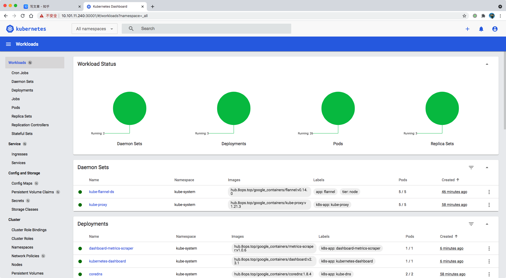
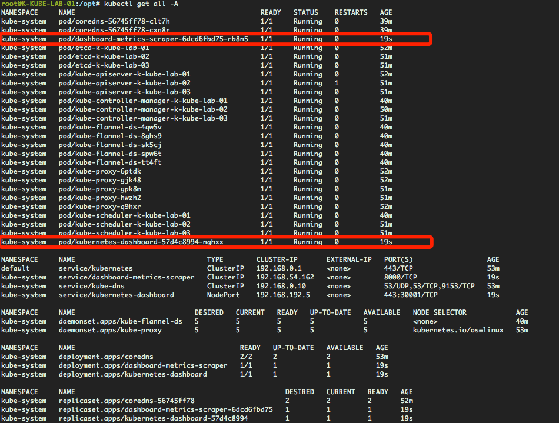
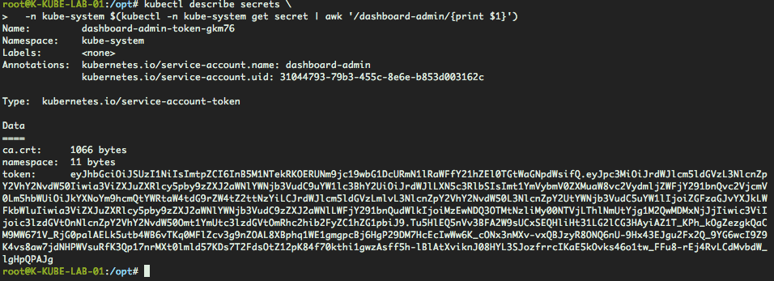
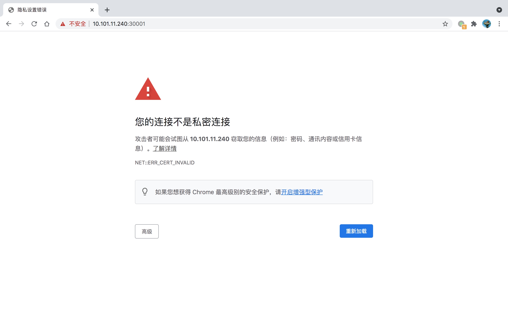
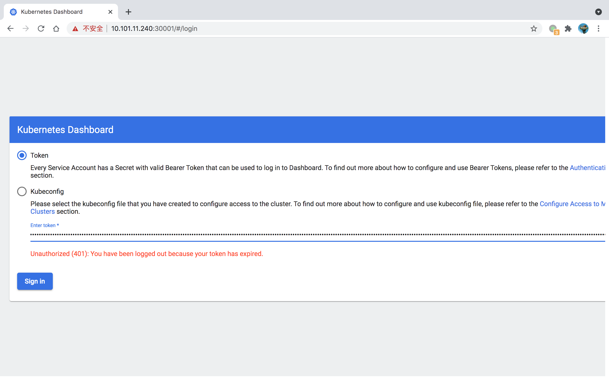

# 实战 | Kubernetes 常用组件-Dashboard

推荐使用helm安装，参考[实战 | Helm的使用](https://books.8ops.top/#/kubernetes/05-helm-usage)


Kubernetes Cluster 安装好后我们需要一个面板来可视化管理，此处我们引用官方的dashboard。

[code](https://github.com/kubernetes/dashboard)




## 一、快速应用

借鉴官方YAML文件做过以下调整

1. 使用私有镜像
2. 命名空间复用kube-system
3. TTL时间延长1天
4. 增加nodeport-30001用于暴露服务

```bash
kubectl apply -f https://books.8ops.top/attachment/kubernetes/addon/01-kube-dashboard.yaml
```


> 演示效果




## 二、创建用户

```bash
# 创建SA
kubectl create serviceaccount dashboard-admin -n kube-system

# 绑定cluster-admin
kubectl create clusterrolebinding dashboard-admin \
  --clusterrole=cluster-admin \
  --serviceaccount=kube-system:dashboard-admin

# 输出token
kubectl describe secrets \
  -n kube-system $(kubectl -n kube-system get secret | awk '/dashboard-admin/{print $1}')
```


> 操作解说

1. 授予管理员权限用于通过dashboard管理cluster
2. 获取网页版登录token


> 演示效果




> 演示效果

通过浏览器访问`https://10.101.11.240:30001/`



创建完成后在**Chrome**浏览器打开提示非安全站点，由于证书是私有的浏览器无法识别，可以通过在页面上盲敲命令**thisisunsafe**成功打开网页。

究其原因是Chrome浏览器对站点访问安全级别较高。


> 演示效果



拷贝之前的token，通过Token的登录选项即可。


## 三、权限解析

用户

```bash
root@K-KUBE-LAB-01:~# kubectl -n kube-system get sa dashboard-admin
NAME              SECRETS   AGE
dashboard-admin   1         5d23h
root@K-KUBE-LAB-01:~# kubectl -n kube-system get sa dashboard-admin -o yaml
apiVersion: v1
kind: ServiceAccount
metadata:
  creationTimestamp: "2021-08-17T02:55:23Z"
  name: dashboard-admin
  namespace: kube-system
  resourceVersion: "6750"
  uid: 31044793-79b3-455c-8e6e-b853d003162c
secrets:
- name: dashboard-admin-token-gkm76
```

权限

```bash
root@K-KUBE-LAB-01:~# kubectl -n kube-system get clusterrolebinding dashboard-admin -o yaml
apiVersion: rbac.authorization.k8s.io/v1
kind: ClusterRoleBinding
metadata:
  creationTimestamp: "2021-08-17T02:55:23Z"
  name: dashboard-admin
  resourceVersion: "6752"
  uid: 7fa29bdc-eaa3-46b3-a0a4-f9985a2602fe
roleRef:
  apiGroup: rbac.authorization.k8s.io
  kind: ClusterRole
  name: cluster-admin
subjects:
- kind: ServiceAccount
  name: dashboard-admin
  namespace: kube-system
root@K-KUBE-LAB-01:~# kubectl -n kube-system get ClusterRole cluster-admin -o yaml
apiVersion: rbac.authorization.k8s.io/v1
kind: ClusterRole
metadata:
  annotations:
    rbac.authorization.kubernetes.io/autoupdate: "true"
  creationTimestamp: "2021-08-17T02:01:54Z"
  labels:
    kubernetes.io/bootstrapping: rbac-defaults
  name: cluster-admin
  resourceVersion: "91"
  uid: d7698abc-af4f-4320-a81f-79a53ce45291
rules:
- apiGroups:
  - '*'
  resources:
  - '*'
  verbs:
  - '*'
- nonResourceURLs:
  - '*'
  verbs:
  - '*'
```


