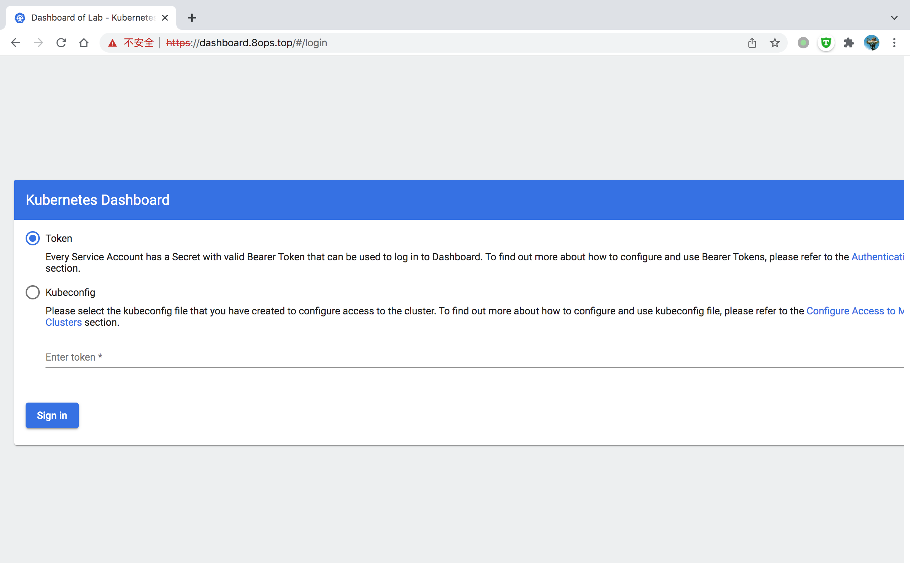

# Helm的使用

[docs](https://helm.sh/zh/docs/)

[helm hub](https://artifacthub.io/) 

## 镜像源私有化

将外部镜像产物拉到私有环境缓存起来

```bash
#!/bin/bash

#
# example
#  pull_image_to_local.sh kubernetesui/metrics-scraper:v1.0.7
#  pull_image_to_local.sh registry.cn-hangzhou.aliyuncs.com/google_containers/nginx-ingress-controller:v1.1.0
#  pull_image_to_local.sh nginx:1.21.4 third
#
# explain
#  docker pull kubernetesui/metrics-scraper:v1.0.7
#  docker tag kubernetesui/metrics-scraper:v1.0.7 hub.8ops.top/google_containers/metrics-scraper:v1.0.7
#  docker push hub.8ops.top/google_containers/metrics-scraper:v1.0.7
#  docker rmi kubernetesui/metrics-scraper:v1.0.7
#  docker rmi hub.8ops.top/google_containers/metrics-scraper:v1.0.7
#

set -e

src=$1
dst=$2
harbor=hub.8ops.top
[ -z $dst ] && dst=google_containers
docker pull ${src}
docker tag ${src} `echo ${src} |awk -v harbor=${harbor} -v dst=${dst} -F'/' '{printf("%s/%s/%s",harbor,dst,$NF)}'`
docker push `echo ${src} |awk -v harbor=${harbor} -v dst=${dst} -F'/' '{printf("%s/%s/%s",harbor,dst,$NF)}'`
docker rmi ${src}
docker rmi `echo ${src} |awk -v harbor=${harbor} -v dst=${dst} -F'/' '{printf("%s/%s/%s",harbor,dst,$NF)}'`

```


## 优化源

生成缓存文件，必要时清空

- ~/.config/helm
- ~/.cache/helm

```bash
# helm repo list
NAME       URL
azure      https://mirror.azure.cn/kubernetes/charts
aliyun     https://kubernetes.oss-cn-hangzhou.aliyuncs.com/charts
elastic    https://helm.elastic.co
gitlab     https://charts.gitlab.io
harbor     https://helm.goharbor.io
bitnami    https://charts.bitnami.com/bitnami
incubator  https://kubernetes-charts-incubator.storage.googleapis.com
google     https://kubernetes-charts.storage.googleapis.com
ingress-nginx       	https://kubernetes.github.io/ingress-nginx
kubernetes-dashboard	https://kubernetes.github.io/dashboard/
```

推荐使用`azure`和`aliyun`


## Ingress-nginx

```bash
helm repo add ingress-nginx https://kubernetes.github.io/ingress-nginx
helm repo update

helm search repo ingress-nginx

helm show values ingress-nginx/ingress-nginx > ingress-nginx.yaml-default

# vim ingress-nginx-external.yaml

# deprecated
# 若不FW需要变更 ~/.cache/helm/repository/ingress-nginx-index.yaml 从私有文件站下载
## sed -i 's#https://github.com/kubernetes/ingress-nginx/releases/download/helm-chart-4.0.13/ingress-nginx-4.0.13.tgz#http://d.8ops.top/ops/helm/ingress-nginx-4.0.13.tgz#' ~/.cache/helm/repository/ingress-nginx-index.yaml

kubectl label no k-kube-lab-04 edge=external
helm install ingress-nginx-external-controller ingress-nginx/ingress-nginx \
    -f ingress-nginx-external.yaml \
    -n kube-server \
    --create-namespace \
    --version 4.0.13 --debug

kubectl label no k-kube-lab-05 edge=internal
helm install ingress-nginx-internal-controller ingress-nginx/ingress-nginx \
    -f ingress-nginx-internal.yaml \
    -n kube-server \
    --version 4.0.13 --debug

helm list -A

# upgrade
helm upgrade ingress-nginx-external-controller ingress-nginx/ingress-nginx \
    -f ingress-nginx-external.yaml \
    -n kube-server \
    --version 4.0.13 --debug

helm upgrade ingress-nginx-internal-controller ingress-nginx/ingress-nginx \
    -f ingress-nginx-internal.yaml \
    -n kube-server \
    --version 4.0.13 --debug


# uninstall     
helm -n kube-server uninstall ingress-nginx-external-controller
```


> vim ingress-nginx-external.yaml

```yaml
controller:
  name: external
  image:
    registry: hub.8ops.top
    image: google_containers/nginx-ingress-controller
    tag: "v1.1.0"
    digest:

  hostNetwork: true
  hostPort:
    enabled: true
    ports:
      http: 80
      https: 443

  config: {} # nginx.conf 全局配置

  ingressClassResource:
    name: external
    enabled: true
    default: false
    controllerValue: "k8s.io/ingress-nginx" # 这里的nginx是缺省的ingress-class

  resources:
    limits:
      cpu: 500m
      memory: 1Gi
    requests:
      cpu: 200m
      memory: 256Mi

  kind: DaemonSet
  nodeSelector:
    kubernetes.io/os: linux
    edge: external

  service:
    enabled: false

  lifecycle:
  admissionWebhooks:
    enabled: false
```


## Dashboard

```bash
helm repo add kubernetes-dashboard https://kubernetes.github.io/dashboard/
helm repo update

helm search repo kubernetes-dashboard

helm show values kubernetes-dashboard/kubernetes-dashboard > kubernetes-dashboard.yaml-default

# vim kubernetes-dashboard.yaml

# deprecated
# 若不FW需要变更 ~/.cache/helm/repository/kubernetes-dashboard-index.yaml 从私有文件站下载
## sed -i 's#kubernetes-dashboard-5.0.4.tgz#http://d.8ops.top/ops/helm/kubernetes-dashboard-5.0.4.tgz#' ~/.cache/helm/repository/kubernetes-dashboard-index.yaml

helm install kubernetes-dashboard kubernetes-dashboard/kubernetes-dashboard \
    -f kubernetes-dashboard.yaml \
    -n kube-server \
    --create-namespace \
    --version 5.0.4 --debug

helm upgrade kubernetes-dashboard kubernetes-dashboard/kubernetes-dashboard \
    -f kubernetes-dashboard.yaml \
    -n kube-server \
    --version 5.0.4 --debug

#-----------------------------------------------------------
# create sa
kubectl create serviceaccount dashboard-admin -n kube-server

# binding cluster-admin
kubectl create clusterrolebinding dashboard-admin \
  --clusterrole=cluster-admin \
  --serviceaccount=kube-server:dashboard-admin

# output token
kubectl describe secrets \
  -n kube-server $(kubectl -n kube-server get secret | awk '/dashboard-admin/{print $1}')
```


> vim kubernetes-dashboard.yaml

```yaml
image:
  repository: hub.8ops.top/google_containers/dashboard
  tag: v2.4.0

resources:
  requests:
    cpu: 200m
    memory: 256Mi
  limits:
    cpu: 1
    memory: 512Mi

ingress:
  enabled: true
  annotations:
    nginx.ingress.kubernetes.io/backend-protocol: "HTTPS"

  className: "external"

  hosts:
    - dashboard.8ops.top
  tls:
    - secretName: tls-8ops.top
      hosts:
        - dashboard.8ops.top

extraArgs: 
  - --token-ttl=86400

settings:
  clusterName: "Dashboard of Lab"
  itemsPerPage: 20
  labelsLimit: 3
  logsAutoRefreshTimeInterval: 10
  resourceAutoRefreshTimeInterval: 10

metricsScraper:
  enabled: true
  image:
    repository: hub.8ops.top/google_containers/metrics-scraper
    tag: v1.0.7
  resources:
    requests:
      cpu: 100m
      memory: 128Mi
    limits:
      cpu: 100m
      memory: 128Mi

metrics-server:
  enabled: true
  image:
    repository: hub.8ops.top/google_containers/metrics-server
    tag: v0.5.0
  resources:
    requests:
      cpu: 100m
      memory: 128Mi
    limits:
      cpu: 100m
      memory: 128Mi
  args:
    - --kubelet-preferred-address-types=InternalIP
    - --kubelet-insecure-tls

```





