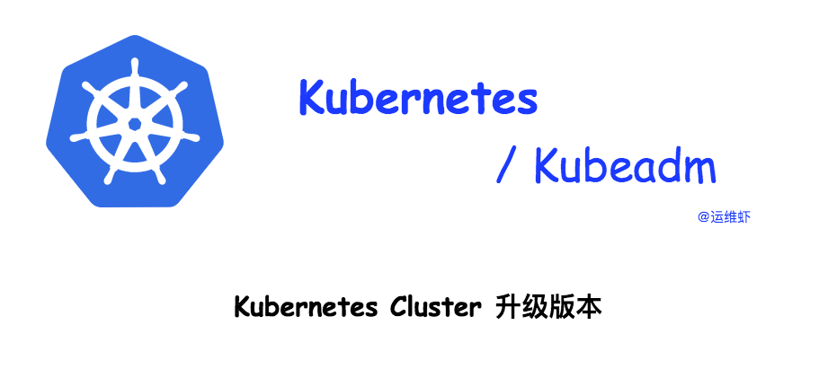

# 实战 | Kubernetes Cluster 升级版本



Kubernetes Cluster升级是一件必要的事情，因为kubernetes更新实在太频繁了。

一旦落下太多版本，很多新特性就会使用不上，同时很多及时的补丁也无法享用。

这里演示我的一次升级过程。


[Upgrading kubeadm clusters | Kubernetes](https://kubernetes.io/docs/tasks/administer-cluster/kubeadm/kubeadm-upgrade/)

[kubeadm upgrade | Kubernetes](https://kubernetes.io/zh/docs/reference/setup-tools/kubeadm/kubeadm-upgrade/)


升级前后版本对比

| 软件名称   | 当前版本               | 最新版本 |
| ---------- | ---------------------- | -------- |
| kubeadm    | v1.22.2                | v1.23.0  |
| kubelet    | v1.22.2                | v1.23.0  |
| kubernetes | v1.22.2                | v1.23.0  |
| etcd       | 3.4.13-0               | v3.5.1   |
| flannel    | v0.15.0                | v0.15.1  |
| coredns    | 1.8.4                  | 1.8.6    |
| containerd | 1.5.5-0ubuntu3~20.04.1 | 1.5.8    |


## 一、镜像同步

推荐使用[image-syncer](https://github.com/AliyunContainerService/image-syncer)

> auth.json

```json
{
  "hub.8ops.top": {
    "username": "",
    "password": ""
  }
}
```


> images.json

```json
{
  "registry.cn-hangzhou.aliyuncs.com/google_containers/kube-apiserver:v1.23.0": "hub.8ops.top/google_containers/kube-apiserver",
  "registry.cn-hangzhou.aliyuncs.com/google_containers/kube-controller-manager:v1.23.0": "hub.8ops.top/google_containers/kube-controller-manager",
  "registry.cn-hangzhou.aliyuncs.com/google_containers/kube-scheduler:v1.23.0": "hub.8ops.top/google_containers/kube-scheduler",
  "registry.cn-hangzhou.aliyuncs.com/google_containers/kube-proxy:v1.23.0": "hub.8ops.top/google_containers/kube-proxy",
  "registry.cn-hangzhou.aliyuncs.com/google_containers/coredns:1.8.6": "hub.8ops.top/google_containers/coredns",
  "registry.cn-hangzhou.aliyuncs.com/google_containers/etcd:3.5.1-0": "hub.8ops.top/google_containers/etcd",
  "registry.cn-hangzhou.aliyuncs.com/google_containers/pause:3.6": "hub.8ops.top/google_containers/pause"
}
```

需要存在项目 `hub.8ops.top/google_containers` ，否则会出现同步不成功情况


```bash
image-syncer --auth=auth.json --images=images.json --arch=amd64 --os=linux
```

一定要指定**arch**，否则会同步非预期的arch镜像产物过来


## 二、升级二进制

```bash
# --------- update ----------- #
apt update
apt-mark showhold
apt install kubeadm=1.23.0-00 kubectl=1.23.0-00 kubelet=1.23.0-00 

# --------- check ----------- #
dpkg -l | grep kube && kubeadm version
apt-mark hold kubeadm kubectl kubelet
apt-mark showhold
```


## 三、升级环境

```yaml
kubeadm upgrade plan 

# first master
kubeadm upgrade apply v1.23.0 -v 5

## kubelet配置未随kubernetes升级，手动介入
# vim /var/lib/kubelet/kubeadm-flags.env
# sed -i 's/pause:3.5/pause:3.6/' /var/lib/kubelet/kubeadm-flags.env
systemctl restart kubelet
systemctl status kubelet

# other master/node
kubeadm upgrade node -v 5

kubeadm certs check-expiration

## coredns未随kubernetes升级，手动介入

```


> vim /var/lib/kubelet/kubeadm-flags.env

```bash
KUBELET_KUBEADM_ARGS="--container-runtime=remote --container-runtime-endpoint=/var/run/containerd/containerd.sock --pod-infra-container-image=hub.8ops.top/google_containers/pause:3.6"
```


