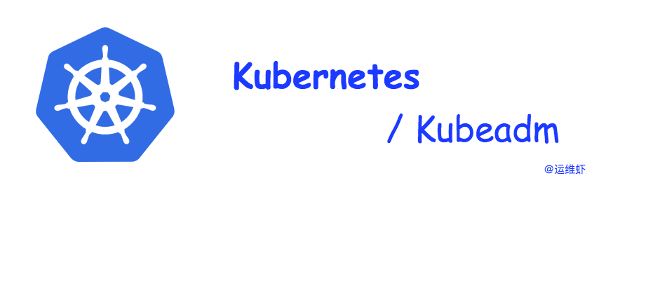

# 实战 | 跨集群迁移容器



在kubernetes cluster相距较大版本升级时，无法直接进行升级。这时需要我们新搭建容器编排环境，再进行应用容器迁移，这里分享我迁移的一次过程。


## 一、技术参考

推荐使用 yq

- [page](https://mikefarah.gitbook.io/yq/)
- [code](https://github.com/mikefarah/yq)

```bash
#!/bin/bash 

for OBJ in $(kubectl api-resources --verbs=list --namespaced -o name)
do
   for DEF in $(kubectl get --show-kind --ignore-not-found $OBJ -o name)
   do
      mkdir -p $(dirname $DEF)
      kubectl get $DEF -o yaml \
      | yq eval 'del(.metadata.resourceVersion, .metadata.uid, .metadata.annotations, .metadata.creationTimestamp, .metadata.selfLink, .metadata.managedFields)' - > $DEF.yaml 
   done
done 
```

将导出的yaml文件通过kubectl apply -f 应用至新的kubernetes cluster编排环境。


## 二、实战操作

### 2.1 设计原理

- 导出原编排环境的资源内容
- 进行相应清除处理
- 进行版本过渡处理
- 在新编排环境应用生效
- 维护新编排环境


### 2.2 展示源码

```bash
#!/bin/bash

[ `dirname $0` == "./bin" ] || exit 1

export PATH="`pwd`/bin":$PATH
kubectl_old="kubectl --kubeconfig=lib/kubeconfig-10.101.11.240"
# ${kubectl_old} api-resources --verbs=list --namespaced -o name 

#-----------------------------------------------------------------------------#
# 11, secrets
function do_secrets(){
#${kubectl_old} label `${kubectl_old} get secrets -o name | awk '/tls-/' | paste -s -d ' '` 8ops.top=true

${kubectl_old} get secrets -o name -l 8ops.top=true -o yaml | \
    yq eval '
        del( 
            .items[].metadata.annotations, 
	    .items[].metadata.creationTimestamp, 
	    .items[].metadata.resourceVersion, 
	    .items[].metadata.selfLink, 
	    .items[].metadata.uid, 
	    .metadata
	)' - | \
    yq eval '
        .items[].metadata.labels["8ops.top"]="true" | 
        .items[].metadata.namespace="kube-app"
        ' - > 11-secrets.yaml
}

#-----------------------------------------------------------------------------#
# 12, services
function do_services(){
#${kubectl_old} get services -l k8s-app=userdoor -o yaml | \
${kubectl_old} get services -l k8s-app -o yaml | \
    yq eval '
        del( 
      .items[].metadata.annotations, 
	    .items[].metadata.creationTimestamp, 
	    .items[].metadata.resourceVersion, 
	    .items[].metadata.selfLink, 
	    .items[].metadata.uid, 
	    .items[].spec.clusterIP,
	    .items[].spec.externalTrafficPolicy,
	    .items[].spec.sessionAffinity,
	    .items[].spec.ports[].nodePort,
	    .items[].status, 
	    .metadata
	)' - | \
    yq eval '
        .items[].metadata.namespace="kube-app" |
        .items[].metadata.labels["8ops.top"]="true" |
        .items[].spec.type="ClusterIP"
        ' - > 12-services.yaml
}

#-----------------------------------------------------------------------------#
# 13, deployments
function do_deployments(){
#${kubectl_old} get deployments -l k8s-app=userdoor -o yaml | \
${kubectl_old} get deployments -l k8s-app -o yaml | \
    yq eval '
        del( 
	    .items[].metadata.annotations, 
	    .items[].metadata.creationTimestamp, 
	    .items[].metadata.generation, 
	    .items[].metadata.resourceVersion, 
	    .items[].metadata.selfLink, 
	    .items[].metadata.uid, 
	    .items[].status, 
	    .metadata 
	)' - | \
    yq eval '
       .items[].metadata.namespace="kube-app" | 
       .items[].metadata.labels["8ops.top"]="true" |
       .items[].spec.replicas=0 |
       .items[].apiVersion="apps/v1" 
       ' - > 13-deployments.yaml
}

#-----------------------------------------------------------------------------#
# 14, ingresses
function do_ingresses(){
#${kubectl_old} label ing `${kubectl_old} get ing | awk '$2~/services.dev.ofc/{printf("%s ",$1)}'` 8ops.top/ingress.class=internal
#${kubectl_old} label ing `${kubectl_old} get ing | awk '$2!~/services.dev.ofc/{printf("%s ",$1)}'` 8ops.top/ingress.class=external

#${kubectl_old} get ingress -l k8s-app=a.guanaitong,8ops.top/ingress.class=external -o yaml | \
${kubectl_old} get ingress -l k8s-app,8ops.top/ingress.class=external -o yaml | \
    yq eval '
        del( 
      .items[].metadata.annotations["kubernetes.io/ingress.class"],  
      .items[].metadata.annotations["kubectl.kubernetes.io/last-applied-configuration"],
	    .items[].metadata.creationTimestamp, 
	    .items[].metadata.generation, 
	    .items[].metadata.resourceVersion, 
	    .items[].metadata.selfLink, 
	    .items[].metadata.uid, 
	    .items[].status, 
	    .metadata 
	)' - | \
    yq eval '
        .items[].apiVersion="networking.k8s.io/v1" |
        .items[].metadata.namespace="kube-app" |
        .items[].metadata.labels["8ops.top"]="true" |
    	  .items[].spec.ingressClassName="external" 
	' - | \
    sed \
        -e '/path:/a \
                pathType: Prefix' \
        -e 's/serviceName: /service: \
                    name: /g' \
        -e 's/servicePort: /  port: \
                      number: /g' > 14-ingresses-external.yaml


${kubectl_old} get ingress -l k8s-app,8ops.top/ingress.class=internal -o yaml | \
    yq eval '
        del( 
      .items[].metadata.annotations["kubernetes.io/ingress.class"],  
      .items[].metadata.annotations["kubectl.kubernetes.io/last-applied-configuration"],
	    .items[].metadata.creationTimestamp, 
	    .items[].metadata.generation, 
	    .items[].metadata.resourceVersion, 
	    .items[].metadata.selfLink, 
	    .items[].metadata.uid, 
	    .items[].status, 
	    .metadata 
	)' - | \
    yq eval '
        .items[].apiVersion="networking.k8s.io/v1" |
        .items[].metadata.namespace="kube-app" |
        .items[].metadata.labels["8ops.top"]="true" |
    	.items[].spec.ingressClassName="internal" 
	' - | \
    sed \
        -e '/path:/a \
                pathType: Prefix' \
        -e 's/serviceName: /service: \
                    name: /g' \
        -e 's/servicePort: /  port: \
                      number: /g' > 14-ingresses-internal.yaml
}

#-----------------------------------------------------------------------------#
# 15, endpoints
function do_endpoints(){
${kubectl_old} get endpoints -l k8s-ep=custom-ep -o yaml | \
    yq eval '
        del( 
	    .items[].metadata.annotations, 
	    .items[].metadata.creationTimestamp, 
	    .items[].metadata.generation, 
	    .items[].metadata.resourceVersion, 
	    .items[].metadata.selfLink, 
	    .items[].metadata.uid, 
	    .items[].metadata.labels["k8s-ep"], 
	    .items[].status, 
	    .metadata 
	)' - | \
    yq eval '
        .items[].metadata.labels["8ops.top"]="true" |
        .items[].metadata.labels["8ops.top/endpoints.custom"]="true" | 
        .items[].metadata.namespace="kube-app" 
       ' - | \
    sed \
	-e '' > 15-endpoints.yaml

}

#-----------------------------------------------------------------------------#

# dump
do_secrets
do_services
do_deployments
do_ingresses
do_endpoints

# apply
kubectl apply -f 11-secrets.yaml
kubectl apply -f 12-services.yaml 
kubectl apply -f 13-deployments.yaml
kubectl apply -f 14-ingresses-external.yaml
kubectl apply -f 14-ingresses-internal.yaml
kubectl apply -f 15-endpoints.yaml

kubectl -n kube-app get deploy -o name | \
awk 'NR>1{
    printf("/usr/bin/kubectl -n kube-app scale --replicas=1 %s;\n",$1);
    if(NR%3==0){printf("sleep 60;\n")}
}' | sh

exit 0
```


### 2.3 跟进维护

由于一次性执行过多的命令去创建资源会导致kubernetes cluster吃不消

```bash
# 查看生效状态
kubectl -n kube-app get po | \
	awk 'NR>1{S[$3]++}END{for(s in S)printf("%10s - %d\n",s,S[s])}'

# 关闭未就位的容器
kubectl -n kube-app scale --replicas=0 `kubectl -n kube-app get deploy | \
	awk 'NR>1&&$3!=$4{printf("deploy/%s ",$1)}'` | \
	sh
```

